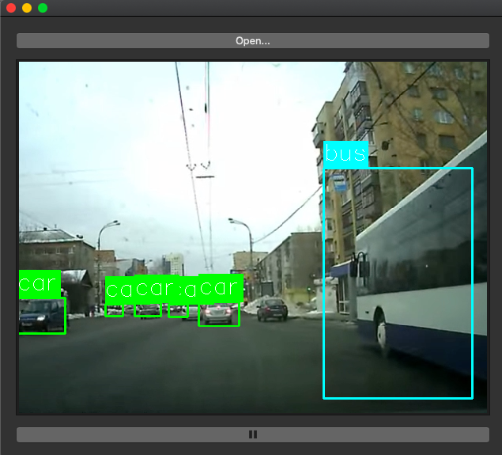

# Traffic Detection



To use the app, first clone this repo. Then either add files from [video-detector-2](video-detector-2) to a Qt project via Qt Creator or compile them using CMake. 

When you run the app, you'll see a window with a button labeled "Open" at the top. Press this button to choose a video to run detection on.

After you've loaded the video, press the play button at the bottom of the window to run detection.


## Model

The model I've used in this app is based on YOLOv3, but I've left only the first 15 convolutional layers and another "YOLO" detection layer. The model is in the folder [yolo-custom](yolo-custom). The source code mostly comes from [this repo](https://github.com/eriklindernoren/PyTorch-YOLOv3). You can refer to that repo for more detailed instructions on how to train the model.

To train the model on custom data, create a folder ```data/custom``` and put your images and labels into it in the following way:  
```images``` - your images  
```labels``` - corresponding labels: one file per image, one row ```class_label center_x center_y width height``` per bounding box. Note that the coordinates should be normalized to [0, 1]  
```train.txt``` contains the paths to training images  
```val.txt``` contains the paths to validation images  
Finally, if you want to train on different classes, you'll need to put ```custom.data``` with info about your dataset and ```custom.names``` with class labels to ```config``` folder. Then, change the number of classes and the number of filters in the last convolutional layer in ```yolov3-tiny.cfg``` in ```config```. Now you can run ```python train.py``` to train the model.

To run detection on static images, run ```python detect.py --image_folder examples```, where ```examples``` is a folder with images.
